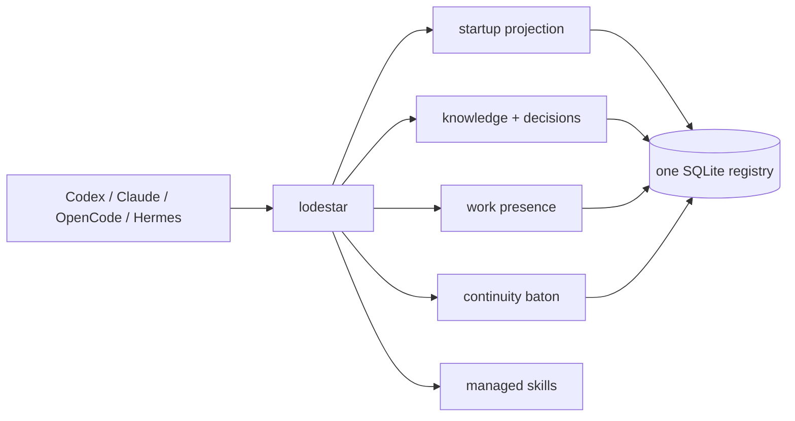

# Lodestar

<p align="center">
  
</p>

<p align="center"><strong>One local CLI for agent project state.</strong></p>

<p align="center">
  <a href="https://www.npmjs.com/package/lodestar-agent-context"></a>
  <a href="https://github.com/VerbalChainsaw/Lodestar/actions/workflows/ci.yml"></a>
  <a href="https://github.com/VerbalChainsaw/Lodestar/releases/latest"></a>
  <a href="https://github.com/VerbalChainsaw/Lodestar/blob/main/LICENSE"></a>
</p>

An agent starting work on a repository rebuilds the same context every time: read
the instruction file, read the README, chase what those reference, guess at what
was already decided. It is slow, it differs between sessions, and decisions that
were reversed months ago quietly come back.

Lodestar answers all of it in one call.

```text
npm install --global lodestar-agent-context
lodestar start --cwd .
```

That returns the project identity, its governing rules, current and superseded
decisions, relevant knowledge, who else is working, and any handoff waiting for
this session — as JSON, bounded to 16 KiB, with exact follow-up commands when
something was left out.

## Why

Measured on this repository with a populated registry:

| | Lodestar | Reading the docs |
| --- | --- | --- |
| Calls | 1 | one per file |
| Bytes returned | **5,872** | 28,456 |
| Wall clock | **155 ms** | file reads + model time |

- **Zero dependencies.** Node's built-in SQLite, nothing else. 66 files installed.
- **One registry.** Windows and WSL reach the same database through a one-shot
  shim. No second engine, no daemon, no background indexer.
- **JSON by default.** `--human` when a person is reading. Errors use the same
  envelope on stderr, so failures parse as reliably as successes.
- **Local only.** No network dependency, no telemetry, no service to run.
- **Checked on three platforms.** Every release runs the full suite on Linux,
  macOS, and Windows against Node 24.15.0, plus CodeQL and packed-artifact smokes.



## The normal loop

```text
lodestar start --cwd .                      # once per session
lodestar find "release process"             # search before reading the repo
lodestar get project:example                # exact record or alias
lodestar links project:example              # one hop of related records
lodestar put --file record.json             # save durable context
```

A missing record means Lodestar does not know that yet — inspect the repository
normally. It is never proof of absence.

## Work presence

Advisory only. It tells other agents what area is busy; it takes no locks.

```text
lodestar work                               # who is working, on what
lodestar work start "Repairing the release pipeline"
lodestar work done "Release repair complete"
lodestar work history --limit 20
```

## Decisions

Append-only events with a deterministic projection, so a reversal stays visible
instead of silently resurfacing.

```text
lodestar decision set database SQLite --reason "local-first, no service"
lodestar decision show                      # FACTS and DEAD
lodestar decision drop database
```

`lodestar start` returns the same projection, so a new session inherits both what
is true and what was explicitly ruled out.

## Continuity

One baton per project, claimed atomically by exactly one successor at startup.

```text
lodestar handoff arm --cwd .
lodestar handoff checkpoint --file packet.json --cwd .
lodestar handoff status --cwd .
lodestar handoff disarm --cwd .
```

## Managed skills

One lifecycle for the bundled skills and instruction templates across Codex,
Claude, Hermes, and OpenCode. Every replacement is staged and backed up, and the
backup path comes back in the response.

```text
lodestar skills install --target all
lodestar skills verify --target all
lodestar skills sync --target all --dry-run
```

## Commands

| Command | Purpose |
| --- | --- |
| `start` | Resolve one project and return bounded startup state; claim a pending handoff when eligible. |
| `get` | Retrieve one exact ID or alias. |
| `find` | Search bounded stored context by query, scope, and kind. |
| `links` | Deterministic one-hop incoming and outgoing links. |
| `put` | Insert or replace one complete record snapshot. |
| `work status\|start\|done\|history` | Read or update advisory work records. |
| `handoff arm\|status\|checkpoint\|now\|disarm` | Session lane and next-session recovery. |
| `decision set\|drop\|show\|inject` | Append decision events; project current and dead values. |
| `skills install\|sync\|verify\|remove` | Manage package-owned client skills and templates. |
| `doctor` | Diagnose schema, integrity, foreign keys, and stored semantics. |
| `export` | Emit a deterministic registry export. |
| `import` | Import supported historical state into the one registry. |
| `delete` | Delete one record and dependent rows transactionally. |
| `init` | Explicitly initialize an empty registry; normally unnecessary. |

Run `lodestar --help` or `lodestar <command> --help`. JSON is the default;
`--human` formats help and responses for reading.

## The JSON contract

Every command returns the same envelope on stdout, and every failure returns the
same shape on stderr:

```json
{
  "v": 1,
  "ok": true,
  "operation": "start",
  "revision": 1336,
  "scope": { "project": "project:git:…", "cwd": "…", "session": null, "actor": null },
  "data": {},
  "more": false,
  "next": []
}
```

`more` says output was bounded. `next` carries the exact commands that recover
what was omitted. Errors carry a stable `code`, `identifiers`, and an `action`.

### Which commands write

`get`, `find`, `links`, `export`, `doctor`, `work status`, `work history`,
`handoff status`, `decision show`, and `skills verify` do not write. Help and
version do not open the database.

`start` is write-capable on purpose: it initializes an absent registry and
atomically claims a pending handoff. With an existing current-schema registry and
no claimable handoff, its database bytes do not change.

## Windows and WSL

One registry, owned by Windows, reached from WSL through a one-shot shim that
invokes the Windows runtime. WSL never opens the SQLite file with a second
engine. `--cwd`, `--db`, `--file`, and import paths accept Windows, MSYS, Cygwin,
WSL, and UNC forms and resolve to the same project identity.

## Storage and migration

One SQLite database with one schema and one migration path. Schema upgrades take
a backup first and refuse to proceed when state would be lost. `lodestar doctor`
reports schema version, integrity, foreign keys, decision and continuity health,
and record counts without writing.

## Requirements

Node.js 24.15.0 or newer. Below that, Node's SQLite is experimental and writes a
warning to stderr that corrupts the error envelope.

## Development

```text
npm test                 # asset parity check plus the full suite
npm run pack:check       # inspect the exact published file list
```

The optional Codex integration ships in the package under `codex-plugin/`.

## License

MIT. See [LICENSE](LICENSE).
