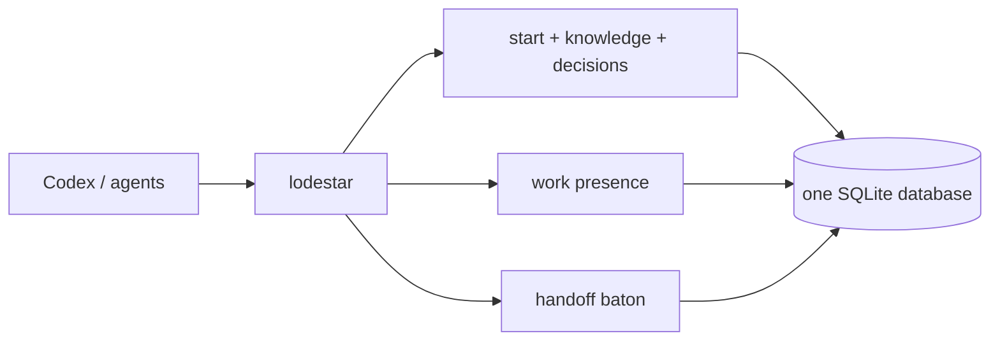

# Lodestar

<p align="center">
  
</p>

<p align="center"><strong>One local state suite for software agents.</strong></p>

<p align="center">
  <a href="https://www.npmjs.com/package/lodestar-agent-context"></a>
  <a href="https://github.com/VerbalChainsaw/Lodestar/actions/workflows/ci.yml"></a>
  <a href="https://github.com/VerbalChainsaw/Lodestar/releases/latest"></a>
  <a href="https://github.com/VerbalChainsaw/Lodestar/blob/main/LICENSE"></a>
</p>

Lodestar gives Codex and other local agents one deterministic interface for
startup context, durable knowledge and decisions, advisory work presence,
session continuity, and managed governance. It is one executable, one SQLite
database, and one JSON envelope—no daemon, network service, or background
indexer.

```text
lodestar start | init | put | get | find | links | delete | import | export
lodestar work | handoff | decision | skills | doctor
```



## One Lodestar product

Lodestar 1.1 absorbs the machine-state jobs that were previously split across
separate tools. Old product names are not compatibility commands.

| Capability | Lodestar interface |
| --- | --- |
| Session orientation | `lodestar start --cwd <cwd>` |
| Exact knowledge lookup | `lodestar get <id-or-alias>` |
| Bounded knowledge search | `lodestar find <query>` |
| Explicit relationships | `lodestar links <id-or-alias>` |
| Durable memory | `lodestar put` |
| Concurrent work presence | `lodestar work ...` |
| Cross-session continuation | `handoff now` in Codex; `lodestar handoff ...` underneath |
| Durable project decisions | `lodestar decision ...` |
| Governance and client installation | `lodestar skills ...` |

Every successful command returns the same versioned envelope. Every mutation
receives a unique, monotonically increasing database revision in the same
`BEGIN IMMEDIATE` transaction as its write.

## Install

Lodestar requires Node.js 24.15.0 or newer and has no runtime dependencies.

```text
npm install --global lodestar-agent-context
lodestar --version
lodestar start --cwd .
```

Managed agent skills and their instruction templates are installed with
`lodestar skills install` and reconciled with `lodestar skills sync`. Claude keeps
using `~/.claude/skills`. Codex recognizes both `~/.codex/skills` and
`~/.agents/skills`, but Lodestar writes to exactly one: `--codex-root codex` or
`--codex-root agents` is authoritative; without an override, an existing
Lodestar-managed copy selects its sole root, otherwise `.agents/skills` is the
deterministic default. Managed copies found in both roots are a conflict.
`lodestar skills verify` reports missing, stale, alternate-root-only, and
duplicate surfaces. To change roots explicitly, rerun install with the desired
`--codex-root` and `--migrate`; Lodestar moves the alternate managed copy to a
timestamped backup outside skill discovery before installing it.
Hermes uses `<HERMES_HOME>/skills`: Lodestar resolves `--hermes-home`, then the
`HERMES_HOME` environment variable, then the platform default
(`%LOCALAPPDATA%\\hermes` on Windows or `~/.hermes` elsewhere). Use
`--target hermes` to manage only that copy. OpenCode uses the deterministic
`~/.config/opencode/skills` root; `--opencode-root <path>` provides an explicit
override. Use `--target opencode` for only OpenCode, or `--target all` for
Codex, Claude, Hermes, and OpenCode. Lodestar stages each replacement beside its
destination so the final rename stays on that client's filesystem. Backups live
under `~/.lodestar`; a WSL client uses `~/.local/state/.lodestar` so backup and
rollback state remains on the Linux filesystem rather than a Windows-linked
state directory.

The managed inventory is `director-protocol`, `codeplan`,
`center-multigeometry`, `center-audit`, `ladder-audit`, and `lodestar`. The
Lodestar umbrella skill owns references for knowledge, work presence,
continuity, decisions, bootstrap behavior, and failure rules. Pass the matching
`--codex-bootstrap`, `--claude-bootstrap`,
`--hermes-bootstrap`, or `--opencode-bootstrap` destination to install, sync,
verify, or remove a configured global instruction entrypoint in the same
compensating transaction. Every replaced bootstrap is backed up with the skill
payload, and every installed destination receives byte-identical canonical text.

The Lodestar skill carries general AGENTS, CLAUDE, and SOUL templates plus
bounded project examples under its native `assets/templates/` directory.
Because they are package-owned skill assets, the same install, sync, backup,
and verification operation covers them; there is no second installer. A write
preflights and stages the complete selected-client batch before changing any
destination. If a handled rename fails, completed moves are compensated in
reverse order and an incomplete rollback is reported with its exact paths.

The exact npm tarball is also attached to every
[GitHub release](https://github.com/VerbalChainsaw/Lodestar/releases). The
package publishes exactly one executable: `lodestar`.

## The normal agent loop

Start once when a session opens:

```text
lodestar start --cwd C:\path\to\project
```

The bounded response contains the canonical project identity, required
instructions, current decision facts and dead values, high-priority context,
current work reports, and an eligible claimed handoff. Startup output is
deterministic and capped at 16 KiB; when
optional context is omitted, `more` is true and `next` contains exact follow-up
commands. Oversized handoff packets receive a bounded startup head. If the
complete required instruction set alone cannot fit, startup fails explicitly
and rolls back any attempted handoff claim.

The first required instruction is generated from Lodestar's package-owned
governance source, so the scope, WIP, gate, verification, version-control, and
incomplete-authority protections do not depend on a separately seeded database.

Then use ordinary verbs:

```text
lodestar get project:example
lodestar find "release process" --scope project:example
lodestar links project:example
lodestar put --file record.json
```

A missing record means only that Lodestar lacks the knowledge. Inspect the
repository normally after a miss.

## Work presence

Work reports are advisory. They help concurrent agents see broad activity; they
do not coordinate, lock, assign authority, or override user instructions.

```text
lodestar work
lodestar work start "Repairing the release pipeline"
lodestar work done "Release repair complete"
lodestar work history --limit 20
```

Mutations require a reliable session identity from `--session` or a supported
harness environment. Repeating `work start` updates that actor's active record.
After `work done`, a later start creates a new history record. Reports sort by
database revision descending, then actor ID.

## Handoff

The optional Codex plugin in [`codex-plugin/`](codex-plugin/.codex-plugin/plugin.json) loads
`lodestar start` once at `SessionStart` and supports the exact natural prompt:

```text
handoff now
```

The plugin authorizes that prompt, validates the semantic packet, redacts
secret-shaped fields and text, and saves it through Lodestar. The source
session cannot claim its own baton. The next eligible same-project session
claims it atomically during startup; retries by that claimant return the same
record and later sessions cannot steal it.

The direct continuity commands are:

```text
lodestar handoff arm --file packet.json --cwd . --session <id>
lodestar handoff status --cwd .
lodestar handoff checkpoint --file packet.json --cwd . --session <id>
lodestar handoff now --file packet.json --cwd . --session <id>
lodestar handoff disarm --cwd . --session <id>
```

Continuity lanes are isolated by canonical project and exact source session.
No plugin-local file is durable state; short-lived host attestations exist only
to authorize exact Codex tool calls.

## Decisions

Decision events are append-only per canonical project. Current facts and
superseded dead values are derived from history and projected at startup.

```text
lodestar decision set database SQLite --reason "one local authority"
lodestar decision drop database --reason "no longer applicable"
lodestar decision show
lodestar decision inject on
```

If a value changes `A -> B -> A`, the final `A` appears only as current and `B`
remains dead. Use narrow keys and bare values; do not store secrets, logs,
temporary progress, personal data, TODOs, or commit IDs as decisions.

## Stable JSON contract

Success:

```json
{
  "v": 1,
  "ok": true,
  "operation": "start",
  "revision": 42,
  "scope": {
    "project": "project:example",
    "cwd": "C:/work/example",
    "session": "abc",
    "actor": "codex:abc"
  },
  "data": {},
  "more": false,
  "next": []
}
```

Errors use the same envelope and replace `data` with
`error: { code, message, identifiers, action }`.

Returned records have one normalized shape:

```json
{
  "v": 1,
  "id": "project:example:commands",
  "kind": "command",
  "scope": "project:example",
  "availability": "known",
  "priority": 0,
  "revision": 42,
  "updated_at": "2026-08-13T12:00:00.000Z",
  "data": {},
  "links": [],
  "sources": []
}
```

Lodestar reads both the original direct-content record form and the wrapped
`content.value` form without rewriting authoritative stored content.

## Commands

| Command | Purpose |
| --- | --- |
| `start` | Resolve one canonical project and return bounded startup state; atomically claim a pending handoff when eligible. |
| `get` | Retrieve one exact ID or alias. |
| `find` | Search bounded stored context by query, scope, and kind. |
| `links` | Return deterministic one-hop incoming and outgoing links. |
| `put` | Insert or replace one complete record snapshot. |
| `work status\|start\|done\|history` | Read or mutate advisory work records. |
| `handoff arm\|status\|checkpoint\|now\|disarm` | Manage a session lane and next-session recovery. Claim occurs in `start`. |
| `decision set\|drop\|show\|inject` | Append decision events and project current/dead values. |
| `skills install\|sync\|verify\|remove` | Manage the package-owned client skills and templates. |
| `doctor` | Diagnose schema, integrity, foreign keys, and stored semantics. |
| `export` | Emit a deterministic registry export. |
| `import` | Import one v0.7 generation store into an empty registry. |
| `delete` | Delete one record and dependent rows transactionally. |
| `init` | Explicitly initialize an empty registry; normally unnecessary. |

Run `lodestar --help` or `lodestar <command> --help`. JSON is the default;
`--human` formats help and responses for reading.

### Mutation behavior

On the current schema, `get`, `find`, `links`, `export`, `doctor`, `work status`,
`work history`, `handoff status`, `decision show`, and `skills verify` do not
write. Help and version do not open the database. `start` is intentionally a
write-capable operation because it initializes an absent registry and atomically
claims a pending handoff; with an existing current-schema registry and no
claimable handoff, its database bytes remain unchanged. Schema-v1 and schema-v2
knowledge reads perform the documented backup-first migration before reading.

`put`, `delete`, work writes, continuity writes, decision writes, `import`,
first-use initialization, and managed-skill install/sync/remove are intentional
mutations. SQLite record mutations allocate their revision inside the same
`BEGIN IMMEDIATE` transaction as the write.

## Windows and WSL

Project identity normalizes Windows paths, WSL mount paths, MSYS/Cygwin paths,
and canonical Git common directories. The same adapter handles path-valued
`--db`, `--file`, and import arguments received by the Windows runtime. On a
shared Windows/WSL machine, the included WSL shim crosses through WSL's
explicit `/init` broker into the installed Windows runtime for each one-shot
command. It does not depend on mutable `binfmt` registration. This keeps one
Windows-owned SQLite connection boundary and one database while remaining
directly callable from WSL. For `skills` operations, the shim translates WSL
client roots to UNC paths while keeping staging and backups on the Linux
filesystem. There is no resident bridge or service.

Default database locations are:

- Windows: `%LOCALAPPDATA%\Lodestar\lodestar.db`
- macOS: `~/Library/Application Support/Lodestar/lodestar.db`
- native Linux: `$XDG_DATA_HOME/lodestar/lodestar.db` or
  `~/.local/share/lodestar/lodestar.db`

Use `--db <path>` or `LODESTAR_DB` for disposable tests and deliberate custom
stores.

## Storage and migration

Schema version 3 has only the universal record model: `records`, `aliases`,
`links`, `sources`, and `metadata`. Knowledge, work, decisions, continuity
lanes, packets, and recovery claims are typed records in that model.
Schema-v2's retired specialized continuity tables are
removed only when all four are empty; migration halts rather than dropping
nonempty state. Every automatic schema migration creates an exclusive backup
first. `lodestar import <manifest.json>` imports supported historical knowledge,
work, decision, continuity, and current Lodestar state transactionally with
checksums and deterministic source identities; rerunning it is idempotent.

Lodestar uses rollback journaling, `synchronous=FULL`, foreign keys, a bounded
busy timeout, and `BEGIN IMMEDIATE` writes. It is a direct CLI, not a database
server or backup system. See [the schema](docs/schema.md),
[limitations](docs/limitations.md), and [v0.7 migration guide](docs/migration-v0.7.md).

## Development

From a source checkout:

```text
npm run assets:build
npm test
npm run assets:check
npm run pack:check
node scripts/benchmark-disposable.mjs
pwsh -File scripts/verify-wsl-installed.ps1
npm pack --json
```

`managed-assets` is the canonical source for every packaged skill, template,
bootstrap, and always-on rule. `npm run assets:build` regenerates the single runtime payload;
`npm test` rejects drift, missing skill frontmatter, numbered-source capture,
retired product vocabulary, and alternate installer files.

`node scripts/benchmark-disposable.mjs` builds a 1,200-record temporary registry, measures
cold and warm-process lookup, full-scan search, startup, diagnostics, state reads, and a
concurrent write burst, then deletes the fixture. It also asserts that the read
phase leaves database bytes and SQLite sidecars unchanged. Its timings are a
local reference, not a release threshold.

On a Windows machine with Ubuntu WSL and the installed Lodestar shim,
`scripts/verify-wsl-installed.ps1` exercises startup, knowledge, links, export,
doctor, work presence, handoff claim, and deletion through the WSL-to-Windows
one-shot boundary using a confined temporary database.

The release workflow tests the packed executable on Windows, Linux, and macOS,
runs CodeQL, publishes the exact tarball to npm with provenance, and attaches
that tarball plus SHA-256 checksums to the GitHub release.

Lodestar is MIT licensed. Security reports should follow [SECURITY.md](SECURITY.md).
