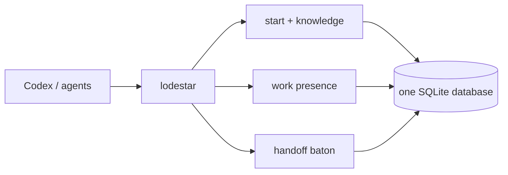

# Lodestar

<p align="center">
  
</p>

<p align="center"><strong>One local state suite for software agents.</strong></p>

<p align="center">
  <a href="https://www.npmjs.com/package/lodestar-agent-context"></a>
  <a href="https://github.com/VerbalChainsaw/Lodestar/actions/workflows/ci.yml"></a>
  <a href="https://github.com/VerbalChainsaw/Lodestar/releases/latest"></a>
  <a href="https://github.com/VerbalChainsaw/Lodestar/blob/main/LICENSE"></a>
</p>

Lodestar gives Codex and other local agents one deterministic interface for
startup context, durable knowledge, advisory work presence, and project
handoff. It is one executable, one SQLite database, and one JSON envelope—no
daemon, network service, or background indexer.

```text
lodestar start | get | find | links | put | work | handoff
```



## One suite, not four

Lodestar 1.1 absorbs the machine-state jobs that were previously split across
separate tools. Old product names are not compatibility commands.

| Capability | Lodestar interface |
| --- | --- |
| Session orientation | `lodestar start --cwd <cwd>` |
| Exact knowledge lookup | `lodestar get <id-or-alias>` |
| Bounded knowledge search | `lodestar find <query>` |
| Explicit relationships | `lodestar links <id-or-alias>` |
| Durable memory | `lodestar put` |
| Concurrent work presence | `lodestar work ...` |
| Cross-session continuation | `handoff now` in Codex; `lodestar handoff ...` underneath |

Every successful command returns the same versioned envelope. Every mutation
receives a unique, monotonically increasing database revision in the same
`BEGIN IMMEDIATE` transaction as its write.

## Install

Lodestar requires Node.js 24.15.0 or newer and has no runtime dependencies.

```text
npm install --global lodestar-agent-context
lodestar --version
lodestar start --cwd .
```

The exact npm tarball is also attached to every
[GitHub release](https://github.com/VerbalChainsaw/Lodestar/releases). The
package publishes exactly one executable: `lodestar`.

## The normal agent loop

Start once when a session opens:

```text
lodestar start --cwd C:\path\to\project
```

The bounded response contains the canonical project identity, required
instructions, high-priority context, current work reports, and an eligible
claimed handoff. Startup output is deterministic and capped at 16 KiB; when
optional context is omitted, `more` is true and `next` contains exact follow-up
commands.

Then use ordinary verbs:

```text
lodestar get project:example
lodestar find "release process" --scope project:example
lodestar links project:example
lodestar put --file record.json
```

A missing record means only that Lodestar lacks the knowledge. Inspect the
repository normally after a miss.

## Work presence

Work reports are advisory. They help concurrent agents see broad activity; they
do not coordinate, lock, assign authority, or override user instructions.

```text
lodestar work
lodestar work start "Repairing the release pipeline"
lodestar work done "Release repair complete"
lodestar work history --limit 20
```

Mutations require a reliable session identity from `--session` or a supported
harness environment. Repeating `work start` updates that actor's active record.
After `work done`, a later start creates a new history record. Reports sort by
database revision descending, then actor ID.

## Handoff

The optional Codex plugin in [`codex-plugin/`](codex-plugin/.codex-plugin/plugin.json) loads
`lodestar start` once at `SessionStart` and supports the exact natural prompt:

```text
handoff now
```

The plugin authorizes that prompt, validates the semantic packet, redacts
secret-shaped fields and text, and saves it through Lodestar. The source
session cannot claim its own baton. The next eligible same-project session
claims it atomically during startup; retries by that claimant return the same
record and later sessions cannot steal it.

The direct state commands are:

```text
lodestar handoff save --file packet.json --cwd . --session <id>
lodestar handoff status --cwd .
lodestar handoff clear --cwd . --session <id>
```

There is one baton lineage per project. No plugin-local file is durable baton
state; short-lived host attestations exist only to authorize the exact Codex
tool call.

## Stable JSON contract

Success:

```json
{
  "v": 1,
  "ok": true,
  "operation": "start",
  "revision": 42,
  "scope": {
    "project": "project:example",
    "cwd": "C:/work/example",
    "session": "abc",
    "actor": "codex:abc"
  },
  "data": {},
  "more": false,
  "next": []
}
```

Errors use the same envelope and replace `data` with
`error: { code, message, identifiers, action }`.

Returned records have one normalized shape:

```json
{
  "v": 1,
  "id": "project:example:commands",
  "kind": "command",
  "scope": "project:example",
  "availability": "known",
  "priority": 0,
  "revision": 42,
  "updated_at": "2026-08-13T12:00:00.000Z",
  "data": {},
  "links": [],
  "sources": []
}
```

Lodestar reads both the original direct-content record form and the wrapped
`content.value` form without rewriting authoritative stored content.

## Commands

| Command | Purpose |
| --- | --- |
| `start` | Resolve one canonical project and return bounded startup state. |
| `get` | Retrieve one exact ID or alias. |
| `find` | Search bounded stored context by query, scope, and kind. |
| `links` | Return deterministic one-hop incoming and outgoing links. |
| `put` | Insert or replace one complete record snapshot. |
| `work status\|start\|done\|history` | Read or mutate advisory work records. |
| `handoff save\|status\|clear` | Save, inspect, or clear the project baton. Claim occurs in `start`. |
| `doctor` | Diagnose schema, integrity, foreign keys, and stored semantics. |
| `export` | Emit a deterministic registry export. |
| `import` | Import one v0.7 generation store into an empty registry. |
| `delete` | Delete one record and dependent rows transactionally. |
| `init` | Explicitly initialize an empty registry; normally unnecessary. |

Run `lodestar --help` or `lodestar <command> --help`. JSON is the default;
`--human` formats help and responses for reading.

## Windows and WSL

Project identity normalizes Windows paths, WSL mount paths, and canonical Git
common directories. On a shared Windows/WSL machine, the included WSL shim
crosses into the installed Windows runtime for each one-shot command. This
keeps one Windows-owned SQLite connection boundary and one database while
remaining directly callable from WSL. There is no resident bridge or service.

Default database locations are:

- Windows: `%LOCALAPPDATA%\Lodestar\lodestar.db`
- macOS: `~/Library/Application Support/Lodestar/lodestar.db`
- native Linux: `$XDG_DATA_HOME/lodestar/lodestar.db` or
  `~/.local/share/lodestar/lodestar.db`

Use `--db <path>` or `LODESTAR_DB` for disposable tests and deliberate custom
stores.

## Storage and migration

Schema version 3 has only the universal record model: `records`, `aliases`,
`links`, `sources`, and `metadata`. Knowledge, work, and handoff are typed
records in that model. Schema-v2's retired specialized continuity tables are
removed only when all four are empty; migration halts rather than dropping
nonempty state. Every automatic schema migration creates an exclusive backup
first.

Lodestar uses rollback journaling, `synchronous=FULL`, foreign keys, a bounded
busy timeout, and `BEGIN IMMEDIATE` writes. It is a direct CLI, not a database
server or backup system. See [the schema](docs/schema.md),
[limitations](docs/limitations.md), and [v0.7 migration guide](docs/migration-v0.7.md).

## Development

```text
npm test
npm run pack:check
npm pack --json
```

The release workflow tests the packed executable on Windows, Linux, and macOS,
runs CodeQL, publishes the exact tarball to npm with provenance, and attaches
that tarball plus SHA-256 checksums to the GitHub release.

Lodestar is MIT licensed. Security reports should follow [SECURITY.md](SECURITY.md).
