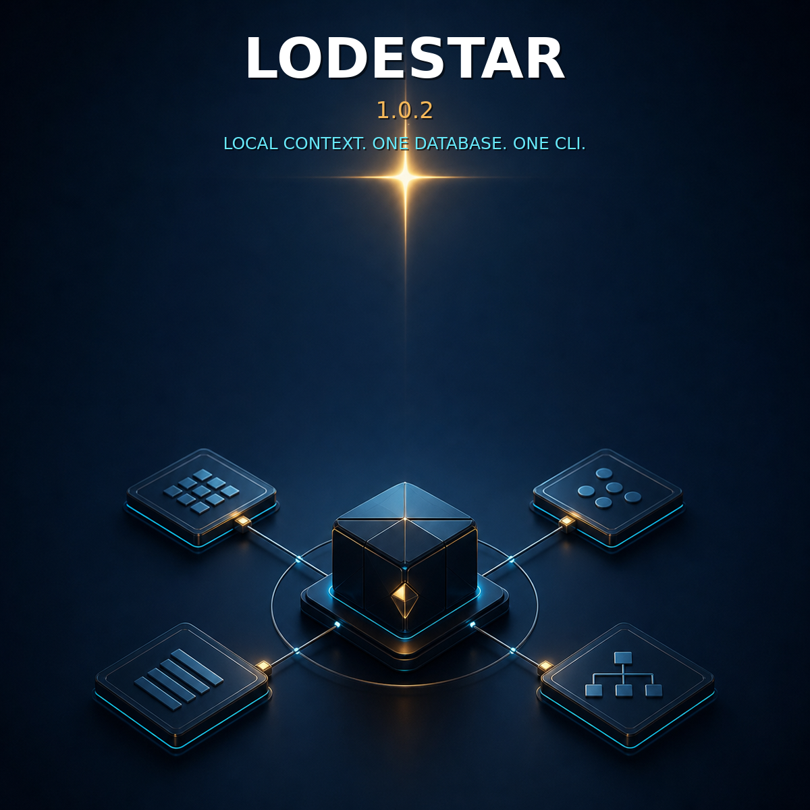

# Announcing Lodestar 1.0

Current release: **Lodestar 1.0.2**



I built Lodestar to give people and software agents a small, dependable place
to keep project context.

Earlier versions became broader and more complicated than that job needed. For
1.0, I narrowed the project back down. Lodestar now stores compact, structured
knowledge in one local SQLite database and retrieves it through stable IDs,
exact aliases, bounded search, and explicit links.

It is intentionally a modest tool. I hope that makes it easier to understand,
trust, and keep working over time.

## Why it exists

Software agents often begin by searching a repository and reconstructing
context that a project already knows. When that context has been recorded,
Lodestar offers a smaller first step:

1. ask for a record by stable ID or alias;
2. follow its declared links;
3. distinguish missing knowledge from an empty known value;
4. inspect the repository normally when Lodestar is insufficient.

Repository inspection still matters. Lodestar does not treat “nothing was
found” as proof that a project is complete. Its knowledge states remain
separate: `known`, `known_empty`, `unavailable`, `unknown`, and `stale`.

## What it includes

- one executable: `lodestar`;
- one local SQLite database;
- deterministic JSON success and error responses;
- records, aliases, explicit links, and source observations;
- bounded search and output;
- atomic SQLite transactions and read-only query connections;
- a one-way, non-mutating importer for v0.7 stores;
- zero runtime dependencies, services, providers, plugins, or network calls.

The first valid write creates the database automatically, so the normal path
does not require a separate setup command:

```text
npm install --global lodestar-agent-context
lodestar put --file record.json
lodestar get project:example:commands
```

`lodestar init` still exists for callers that deliberately want an empty
registry or the tiny agent bootstrap contract, but normal use does not require
it.

## What changed from earlier versions

The 1.0 runtime no longer contains generation trees, custom commit pointers,
heartbeat locks, snapshot hierarchies, quarantine stores, readiness scoring,
repository discovery, provider experiments, installer rollback, benchmark
commands, agent orchestration, or multiple executables.

SQLite and normal operating-system behavior now handle persistence and
durability. The older v0.7 format remains available through a one-way,
read-only importer rather than a second live storage engine.

## About 1.0.2

Version 1.0.1 already contains the complete zero-touch runtime. Version 1.0.2
does not alter that runtime contract. It adds a clearer front page, artwork,
announcement material, and npm metadata.

Install the current version:

```text
npm install --global lodestar-agent-context@1.0.2
```

- npm: <https://www.npmjs.com/package/lodestar-agent-context>
- source: <https://github.com/VerbalChainsaw/Lodestar>
- release: <https://github.com/VerbalChainsaw/Lodestar/releases/tag/v1.0.2>

## Short announcement

> I just published Lodestar 1.0.2. It is a small local context registry: one
> SQLite database, one `lodestar` executable, deterministic JSON, stable IDs
> and aliases, and explicit links. The first valid write creates the registry
> automatically. There is no background service or runtime network
> requirement.
>
> `npm install --global lodestar-agent-context`
>
> <https://github.com/VerbalChainsaw/Lodestar>

## Social card alt text

Dark navy launch artwork for Lodestar 1.0.2. A bright north star guides four
structured knowledge cards connected to one compact local registry. Text reads:
“LODESTAR 1.0.2 — LOCAL CONTEXT. ONE DATABASE. ONE CLI.”
