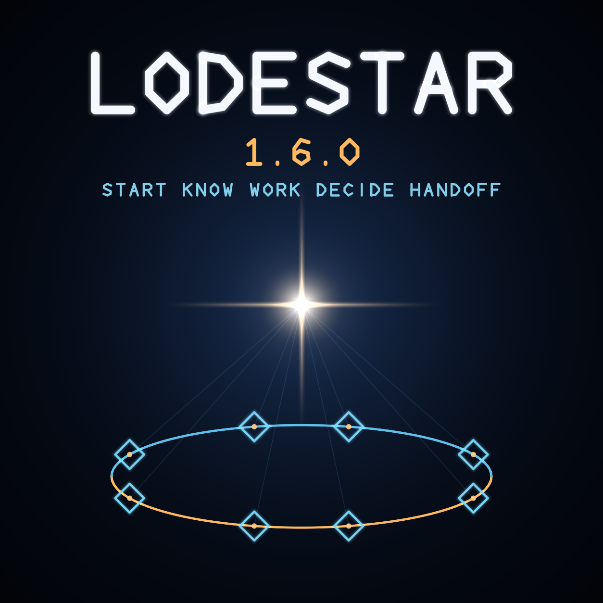

# Announcing Lodestar 1.6

> **Historical announcement.** This page describes the 1.6 release line and is not current operating guidance. See the [current documentation](../README.md) and [2.1.2 release notes](../releases/v2.1.2.md).

Current release: **Lodestar 1.6.0**



Lodestar is a small, dependable place for people and software agents to keep
project context: one local SQLite database, one `lodestar` executable, and a
deterministic JSON envelope for every answer.

1.0 narrowed the project back down to that job. 1.5 tightened the boundary:
Lodestar stopped owning external skill directories and repository agent
files, and its skill and agent surfaces became read-only verification. 1.6 is
the lean release that follows — the retired machinery is gone, the remaining
paths are faster, the hooks fail soft, and the shipped skill package grew.

## What 1.6 removes

- the v0.7 generation-store importer (`lodestar import` and the legacy
  modules), because the registry has been schema v4 with one internal
  migration path for a long time;
- the startup-budget mechanism entirely — `start` always returns every
  optional record, with no `--startup-budget` flag and no truncation surface;
- Stop-hook ledger capture — the decision ledger changes only through
  explicit `lodestar decision` commands;
- the release hero-image gate, so a marketing image never gates a release.

## What 1.6 improves

Record fetch paths are batched: startup context, find, links, decisions,
pending, and work lists now assemble records with a constant number of
queries. On a 1,000-record registry, `start` drops from ~118ms to ~44ms and
`find` from ~134ms to ~24ms. Writes default their metadata instead of
rejecting it, `find` paginates with `--limit` and `--offset` and reports the
exact next command, and the Codex hooks fail soft when the runtime is missing
or identity fields are absent.

The managed skill payload grew additively: the `adderall` skill joined the
canonical set, and the current reference material was restored — nothing in
the payload was removed or shrunk.

## What it includes

- one executable: `lodestar`;
- one local SQLite database;
- deterministic JSON success and error responses;
- records, aliases, explicit links, and source observations;
- bounded search with pagination;
- startup context, advisory work presence, session continuity, and durable
  project decisions with `[DECISION]`, `[SUPERSEDED]`, and `[DEAD]` markers;
- read-only skill verification and agent-file status;
- a managed skill package of seven full-strength skills;
- zero runtime dependencies, services, providers, or network calls.

The first valid write creates the database automatically:

```text
npm install --global lodestar-agent-context
lodestar put --file record.json
lodestar get project:example:commands
```

## About 1.6.0

Version 1.6.0 is the first published release since 1.4.1. It includes the
1.5.0 boundary tightening — read-only skill and agent surfaces, decision
markers with one unified grammar — plus the lean-reduction work described
above.

Install the current version:

```text
npm install --global lodestar-agent-context@1.6.0
```

- npm: <https://www.npmjs.com/package/lodestar-agent-context>
- source: <https://github.com/VerbalChainsaw/Lodestar>
- release: <https://github.com/VerbalChainsaw/Lodestar/releases/tag/v1.6.0>

## Short announcement

> Lodestar 1.6.0 is out: the lean release. The retired v0.7 importer and the
> startup-budget machinery are gone, `start` always returns every optional
> record, record fetches are batched and measurably faster, `find` paginates,
> and the Codex hooks fail soft. The managed skill payload grew additively
> with the Adderall skill. One SQLite database, one `lodestar` executable,
> deterministic JSON, zero runtime dependencies.
>
> `npm install --global lodestar-agent-context@1.6.0`
>
> <https://github.com/VerbalChainsaw/Lodestar>

## Social card alt text

Dark navy artwork for Lodestar 1.6.0. A bright four-point lodestar guides an
orbit ring of eight diamond nodes around one central registry. Text reads:
“LODESTAR 1.6.0 — START KNOW WORK DECIDE HANDOFF.”
